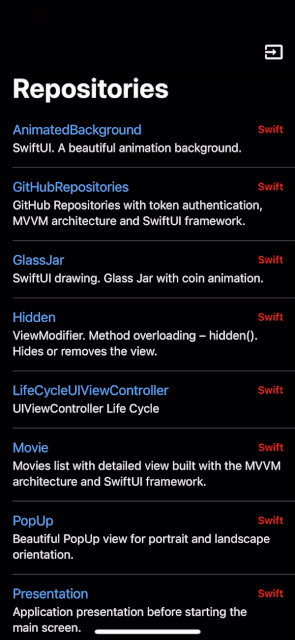

# PullToRefreshSwiftUI

Pull to refresh for SwiftUI.



### Usage with @State

```swift
import SwiftUI

struct ContentView: View {
    @State private var isShowRefresh = false
    
    var body: some View {
        List {
            // ...
        }
        .pullToRefresh(isShowing: $isShowRefresh, deadline: 2) {
            // Your update logic is here...
            
            isShowRefresh = false
        }
    }
}
```

### Usage with @Published
```swift
import SwiftUI

struct ContentView: View {
    @StateObject private var viewModel = ViewModel()
    
    var body: some View {
        List {
            // ...
        }
        .pullToRefresh(isShowing: $viewModel.isShowRefresh) {
            viewModel.refresh()
        }
    }
}
```
```swift
import Foundation

class ViewModel: ObservableObject {
    @Published var isShowRefresh = false
    
    func refresh() {
        // Your update logic is here...
        
        isShowRefresh = false
    }
}
```

## Requirements
- [SwiftUI](https://developer.apple.com/xcode/swiftui/)
